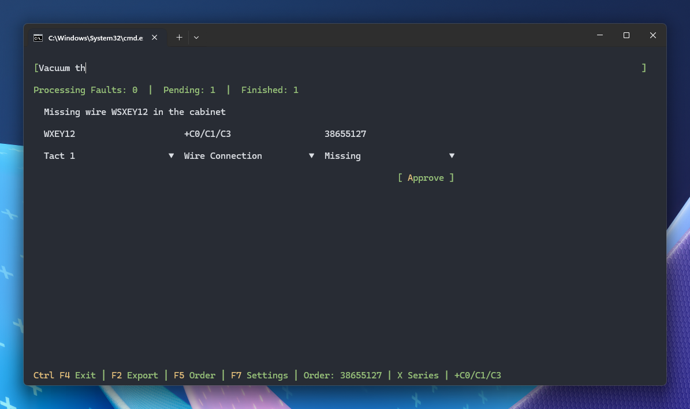

# Henkel
   



## Overview

The Henkel Fault Classification Tool is a comprehensive application designed to streamline the process of logging, classifying, and processing faults within industrial settings. Built with efficiency and user-friendliness in mind, this tool allows operators and engineers to input fault data, classify it according to predefined categories, and manage the fault resolution process effectively.

## Features

- **Fault Logging**: Easy-to-use interface for entering fault details.
- **Dynamic Classification**: Automated suggestions for fault classification based on input data.
- **Order and Cabinet Management**: Manage and track faults by order number and cabinet type.
- **Pending Faults Handling**: Specialized interface for managing faults that require further review or classification.
- **Data Export**: Capability to export processed faults for reporting and analysis.

## Technical Requirements

To run the Henkel application, ensure your system meets the following requirements:

### .NET

- **.NET Version**: [.NET 6.0 SDK](https://dotnet.microsoft.com/en-us/download/dotnet/6.0)

### Packages

The application depends on the following NuGet packages:

- [**NStack.Core**](https://www.nuget.org/packages/NStack.Core) Version 1.0.5
- [**Terminal.Gui**](https://www.nuget.org/packages/Terminal.Gui) Version 1.8.2

## Compilation Instructions

This project is developed using .NET 6.0, ensuring compatibility with a wide range of operating systems. To compile the project, you will need the .NET 6.0 SDK installed on your machine.

1. Clone the repository or download the source code.
2. Navigate to the project directory where `Henkel.csproj` is located.
3. Open a terminal or command prompt in this directory.
4. Run the following commands to install the dependencies and build the project:

```shell
dotnet add package NStack.Core --version 1.0.5
dotnet add package Terminal.Gui --version 1.8.2
```

```shell
dotnet build
dotnet run
```
This command compiles the application and places the output in the `bin/` directory under the project folder.

## Running Instructions
To run the Henkel Fault Classification Tool, follow these simple steps:

1. Download the latest release ZIP file from the project's release page.
2. Extract the ZIP file to a desired location on your computer.
3. Navigate to the extracted folder and locate the `henkel.exe` executable file.
4. Double-click `henkel.exe` to run the application.

## Usage Instructions

Upon launching the Henkel Fault Classification Tool, you will be greeted with the main interface where you can start logging faults.  

- **Entering a Fault**: Click on the "New Fault" button and fill in the details in the provided fields.
- **Classifying Faults**: As you type, the tool will suggest classifications based on predefined rules. You can accept a suggestion or enter your own classification.
- **Managing Orders**: Access the "Order Properties" dialog to set or change the current order number and cabinet details.
- **Processing Pending Faults**: Navigate to the "Pending Faults" section to review and approve faults that couldn't be automatically classified.
- **Exporting Data**: Once you have processed the faults, use the "Export" function to save the data for further analysis or reporting.

## Maintenance and Support

This application is now **archived and will no longer be maintained**. Its usage is not recommended unless there are no other options available. We suggest using the succeeding application, [DN Henkel Vision]([https://github.com/branislavjuhas/dn-henkel-vision](https://github.com/branislavjuhas/dn-henkel-vision)), which offers enhanced features and support.
